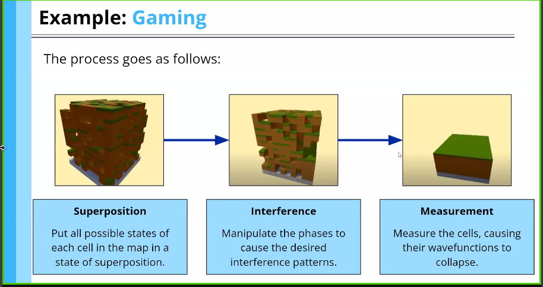

## Modifying Double Slit experiment

#### Two Double slits
When two electrons are simultaneously launched to two different double slits, it leads to non-interference pattern

## Wave Functions
Wave functions describe state of a Quantum Object. It is technically given as 

Quantum Computers use *phase difference* $\phi$ and the amplitude of solutions. This makes the required solution to be constructively interfered and destructively interfere with others. 

![[Screenshot_20231022_223501.png]]

![[Screenshot_20231022_224259.png]]
![[Screenshot_20231022_224259 1.png]]![[Screenshot_20231022_224259 2.png]]

![[Screenshot_20231022_231410.png]]