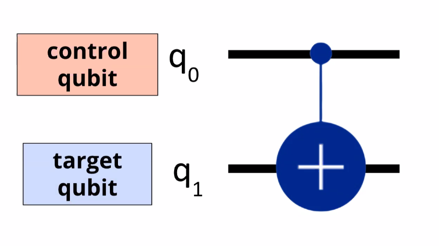

Most algorithms use Multi Qubit Circuits
### CNOT Gate:

The target Qubit depends upon the state of the Control Qubit
**Rules:**
1. Control qubit is not changed
2. If control is 0, no change to target
3. If control is 1, X Gate is applied to target qubit. 

#### Creating Entanglement: 
