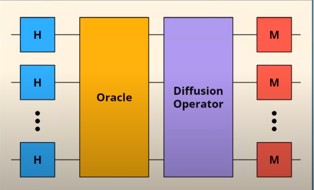

--- 
layout: post
title: Grover's Algorithm
---
# Grover's Algorithm
## Limitations of Classical Algorithms
1. CA are slow
2. Sometimes inefficient
3. Struggle to solve NP and NP-Hard problems

## Unstructured Search
Data which cannot be organised to to the lack of underlying pattern in it is called as unstructured data. Searching in such data is called unstructured search. Searching in unstructured data follows the below properties:
1. The solution or the object to be searched is knows but there is absence of information about it's location.
2. The items in the data are not in any order.

### Quantum Approach
1. The superposition property of QC is useful as it will be used to create a superposition of all possible states.
2. Interference will be used to remove the undesired states using destructive interference and consecutive interference to desired states.
3. Example: Solving a maze problem, all possible paths are bought to superposition and only the desired paths which lead to the required end of the maze is constructively interfered.  

## Grover's Algorithm:


Grover's Algorithm speeds up Quantum search for unstructured data using **amplitude amplification** achieving quadratic speedup .i.e $$\text{No. of operations in Grover's Algotithm}=\sqrt{\text{No. of operations in Linear Search}}$$
1. All the states are bought into superposition: All states are are converted to quantum states each of equal probability to be measured .i.e equal superposition.
2. Oracle match state step: Marks the state we want by changing the phase of that state.
3. Diffuser's step: Amplifies marked stated done by oracle. (This step might be repeated multiple times until desired amplitude is obtained)
4. Interference step: 
5. Measurement

**Example:**
1. Feature of the state is represented as qubits; consider two features .i.e $q_0$ and $q_1$.
2. All the possible states are considered:
   $$\ket{00}+\ket{01}+\ket{10}+\ket{11}$$
3. Every state is bought to equal probability to be measured using superposition.  $$\frac{1}{2}(\ket{00}+\ket{01}+\ket{10}+\ket{11})$$
4. The Oracle flips the phase of desired state. Let $\ket{11}$ be the desired state. $$\frac{1}{2}(\ket{00}+\ket{01}+\ket{10}-\ket{11})$$
5. Diffuser performs amplification of the desired state multiple times .i.e by constructively interfering with desired state.  $$\frac{1}{2\sqrt{12}}(\ket{00}+\ket{01}+\ket{10}+\sqrt{8}\ket{11})$$
6. When measurement is done, as $\ket{11}$ has higher probability, $\ket{11}$ is obtained.

## Inner working of Grover's Algorithm
1. Complex items representation: if there are *n* features to be considered while searching, *n* qubits with $2^n$ possibilities are required.
2. Number of iterations: $\sqrt{n}$
3. Building Oracle: Depending on the problem, the oracle is built. A simple approach may be encoding the solution or criteria.

**Note:**
Grover's Algorithm requires large computation and hence is still in theory for the scale to be applied in. It is estimated around 10k qubits are required for building the algorithm.

## Code
```python
def set_io_qubits(qubit_count):
    """Add the specified number of input and output qubits."""
    input_qubits = [cirq.GridQubit(i, 0) for i in range(qubit_count)]
    output_qubit = cirq.GridQubit(qubit_count, 0)
    return (input_qubits, output_qubit)
```

```python
def make_oracle(input_qubits, output_qubit, x_bits):
    """Implement function {f(x) = 1 if x==x', f(x) = 0 if x!= x'}."""
    yield (cirq.X(q) for (q, bit) in zip(input_qubits, x_bits) if not bit)
    yield (cirq.TOFFOLI(input_qubits[0], input_qubits[1], output_qubit))
    yield (cirq.X(q) for (q, bit) in zip(input_qubits, x_bits) if not bit)
```

```python
def make_grover_circuit(input_qubits, output_qubit, oracle):
    """Find the value recognized by the oracle in sqrt(N) attempts."""
    # For 2 input qubits, that means using Grover operator only once.
    c = cirq.Circuit()

    # Initialize qubits.
    c.append([cirq.X(output_qubit), cirq.H(output_qubit), cirq.H.on_each(*input_qubits)])

    # Query oracle.
    c.append(oracle)

    # Construct Grover operator.
    c.append(cirq.H.on_each(*input_qubits))
    c.append(cirq.X.on_each(*input_qubits))
    c.append(cirq.H.on(input_qubits[1]))
    c.append(cirq.CNOT(input_qubits[0], input_qubits[1]))
    c.append(cirq.H.on(input_qubits[1]))
    c.append(cirq.X.on_each(*input_qubits))
    c.append(cirq.H.on_each(*input_qubits))

    # Measure the result.
    c.append(cirq.measure(*input_qubits, key='result'))

    return c

def bitstring(bits):
    return ''.join(str(int(b)) for b in bits)

def main():
    qubit_count = 2
    circuit_sample_count = 10

    # Set up input and output qubits.
    (input_qubits, output_qubit) = set_io_qubits(qubit_count)

    # Choose the x' and make an oracle which can recognize it.
    x_bits = [random.randint(0, 1) for _ in range(qubit_count)]
    print(f'Secret bit sequence: {x_bits}')

    # Make oracle (black box)
    oracle = make_oracle(input_qubits, output_qubit, x_bits)

    # Embed the oracle into a quantum circuit implementing Grover's algorithm.
    circuit = make_grover_circuit(input_qubits, output_qubit, oracle)
    print('Circuit:')
    print(circuit)

    # Sample from the circuit a couple times.
    simulator = cirq.Simulator()
    result = simulator.run(circuit, repetitions=circuit_sample_count)

    frequencies = result.histogram(key='result', fold_func=bitstring)
    print(f'Sampled results:\n{frequencies}')

    # Check if we actually found the secret value.
    most_common_bitstring = frequencies.most_common(1)[0][0]
    print(f'Most common bitstring: {most_common_bitstring}')
    print(f'Found a match: {most_common_bitstring == bitstring(x_bits)}')
```