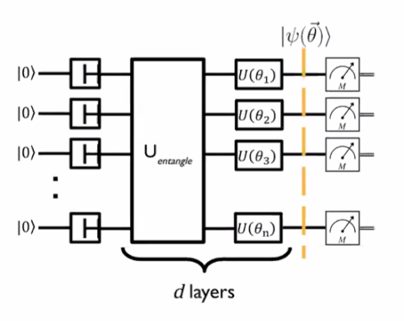
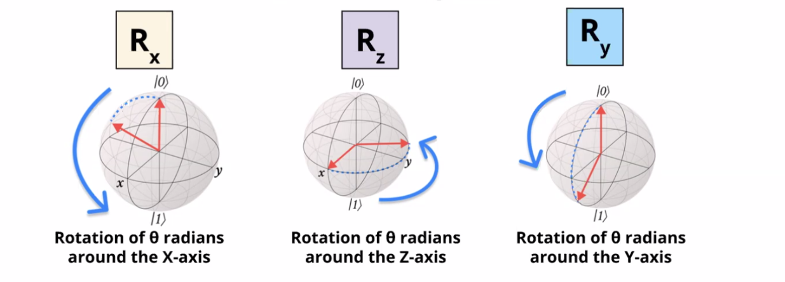

# Near Term Algorithms (NISQ)
## Types of Algorithms:
1. **Long Term Algorithms:**
   - Long Term Algorithms are more powerful and assume perfect fault tolerant hardware.
   - These type of algorithms require millions of qubits which would help in isolating noise to acceptable level.
   - Ex: Grover's Algorithm
2. **NISQ (Noisy Intermediate Scale Quantum):** 
   - NISQ also called as Near term algorithms along side classical computer to perform more efficiently than classical one
   - Ex: VQE Algorithm

## Types of NISQ:
1. **Hybrid Quantum Algorithms (HQA):**
   - Hybrid algorithms use both quantum computing and classical computing to solve problems.
   - The Hybrid algorithms can follow the below steps:
     1. Quantum Computer (QC) runs your quantum circuit
     2. QC sends the result to the Classical Computer (CC).
     3. CC determines how to modify the circuit.
     4. CC sends new instructions to the QC
     5. The above steps iterate

2. **Variational Quantum Algorithms (VQA):**
   
   - Variational quantum algorithms use a process called *optimisation* to find the best solution to the problem.
   - To compensate for the errors in today's quantum computers , we use variational quantum circuits.
   - These tunable circuit is called as **ansatz** which is filled in the template with the choice of the tunable parameter.
   - Ex of tuning can be tuning a gate such that it is between Identity gate and X gate over iterations.
   - These are often done using tunable gates. 
   - These are intuitive and are similar to Deep Learning backpropagation networks where loss function is used to tune the model.

## Knapsack Problem - Problems for VQA 
VQA is useful for solving such problems and with help of the superposition property of QC, all the possibilities can be tested.
1. *Quantum circuit setup:*  The parameters of this circuit represent whether to include or exclude each item in the knapsack. Each qubit in the circuit corresponds to an item. The state of the qubit indicates whether the item is included (1) or excluded (0).
2. *Encoding Choices:* Adjust the parameters of the quantum circuit to encode different combinations of items in the knapsack.
3. *Defining a Function:* Define a function that the quantum algorithm will try to maximise. In the knapsack problem, this function represents the total value of the included items.
4. *Classical Optimisation:* Use classical optimisation techniques to adjust the parameters of the quantum circuit. The goal is to find the combination of items that maximises the total value within the knapsack's weight limit.
5. *Measurement:* Run the quantum circuit and measure the output.

Such problem solving approach can be used for real-world problems such as:
1. Activating a electron which requires energy similar to the knapsack problem.
2. Given set of Amino acids in a protein, arrangement minimal energy.
3. Route Optimisation 

## Current Stand of NISQ
1. **Variational Quantum Eigensolver (VQE):** This algorithm tackles problems in quantum chemistry. It helps find the lowest possible energy state (ground state) of a molecule or other quantum system.
2. **Quantum Approximate Optimisation Algorithm (QAOA):** This one focuses on solving complex optimisation problems. It helps find the "best" solution when dealing with many different options, like finding the most efficient route for deliveries.
3. **Quantum Support Vector Machine (QSVM):** This algorithm applies the power of quantum computing to machine learning tasks. Specifically, it aims to improve the performance of classifying data, such as identifying spam emails or recognising objects in images.