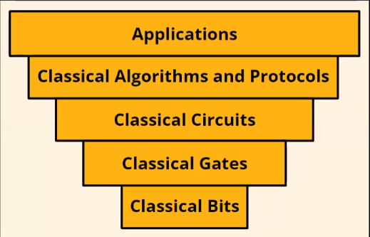

--- 
layout: post
title: 01 Classical Computing
---

# Classical Computing
## Stack
1. Bits
2. Gates
3. Circuits
4. Algorithms and Protocols
5. Applications

## Classical Computing Key Terminologies
### Bits
Bits are the fundamental units of Information in a computer. 
Transistors work on the principal of Bits. 0 being OFF and 1 being ON
Bits based transistors can make building a complex system easier. Transistors hence are called as electrical switches of Computers

### Gates
Gate manipulate bits.

NOT Gate:

AND Gate:

### Circuits
Circuit is a sequence of Gates. It is formed using combination of multiple gates providing complex outputs compared to single Gates

Full Adder Circuit of 2 Inputs is a circuit used to add two numbers

Example: (2 + 3) using Full Adder Circuit

### Algorithms & Protocols
A&P are the agreed-upon steps computers used to solve problems using decision thinking.

