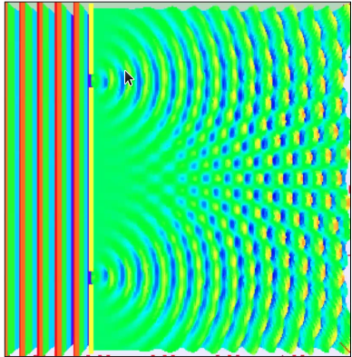

# Quantum Mechanics
## Drawbacks of Classical Physics
1. Couldn't explain why atom are stable even though electron revolved which by definition should have collapsed with nucleus.
2. Classical Physics defines either objects are particles or have wave properties. These principals couldn't be applied to scale level of electrons.
3. Classical Physics couldn't explain the domain which light belongs to .i.e is it particle or wave.

#### Note: 
1. Waves can exist at continuous spread of locations which particle cannot due the capability of waves to show the property of interference. 
2. Constructive interfaces is where the peaks of eaves line up adding up and providing high amplitude waves. Descriptive interface is the where \the high peaks line up with low peaks and cancel out each other. These two together provide interface patters. 

#### Young's Double Slit Experiment
1. The experiment showed a Interference pattern.
2. This corresponded to light showing wave properties. 
3. Electrons show a similar property as light (photons). Replacing light with electrons clearly provided an interference pattern. 
4. The electrons here interfere with itself exhibiting wave property.
5. When the electron travels through the slit, it is unknown which path the electron takes to attain the final destination. In Quantum Mechanics, it is treated that electrons takes all the parts .i.e it enacts as a superposition of wave while travelling. 

## Wave Particle Duality
Wave-Particle Duality is the key concept of Quantum Mechanics.Electrons and light exhibit this behaviour proved by the photo electric experiment

#### Quantum Mechanics explains the stability of Atom

#### Superposition
1. The ability of a quantum object to be in multiple states at the same time time
2. Wave functions describe the electrons spread all through like a wave. It describes the probability of finding the electron in each possible state. The state at which probability of finding the electron is high and this is called amplitude. 

#### Interference
1. The ability of waves and wave functions to add up or cancel each other out.
2. The weird property of electrons when they behave as waves it to split into two waves and then interfere with itself. This changes the probability of finding electrons to be different. 
   
#### Measurement
1. The process of forcing a superposition to pick what state the object will be in. This process irreversible and destroys the superposition.
2. The clear importance of Measurement is that it is forced decide a state of the electron when it is in superposition, .i.e in terms of double slit experiment, when the electrons are travelling.
3. The result of measurement is random. This is due to the fact when the electron is forced to pick a state from the state of superposition, it not possible to be deterministic which path or potion the electron takes. 
4. Ensemble of electrons provide a certain pattern (interference pattern) but if measurement of wavefunction of individual electron is random.
5. **IMPORTANT:**  If a detector is kept on near the one of the slit, the interference pattern disappears. This is due to the fact interference 

#### Entanglement
1. When one object state is depended on other object state. 
2. When a single electron was measured using a detector and caused a non-interference pattern. When one more electron was led to pass through the slit, the same occurred. This is due to the fact that wavefunction remains the same for both those electrons (and similarly for n electrons)

## Applications - Beauty of Superposition and Interference 

While solving a problem which can have n approaches but can have a solution, Classical approaches can take trial-error approach and a lot of time to solve the problem. Quantum approach uses superposition to consider all possible approaches. 

Interference helps us in choosing the right path.

