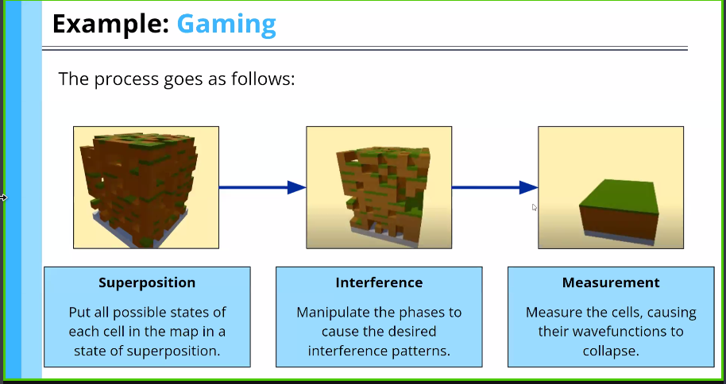

--- 
layout: post
title: 05 Phase and Amplitude
---
# Phase and Amplitude
## Modifying Double Slit experiment

#### Two Double slits
When two electrons are simultaneously launched to two different double slits, it leads to non-interference pattern

## Wave Functions
Wave functions describe state of a Quantum Object represented as $\pshi$ . They form the core of Quantum Calculations. To wave functions, two important components exist. 
1. **Amplitude**: 
   The height or size of a wave is termed as amplitude.  Amplitude determines how likely it is to be measured. 
2. **Phase Difference:**
   The shift of a wave relative to another is called as phase. It determines the resultant wave after an interference. (In-phase waves interfere to from wave with larger amplitude hence constructive interference. Destructive interference is formed when out-phase interfere to reduce the resultant amplitude.)

Quantum Computers use phase difference to solve questions

Quantum Computers use *phase difference* $\phi$ and the amplitude of solutions. This makes the required solution to be constructively interfered and destructively interfere with others. 

### Gaming Example:
A superposition state of all possible state can be modified by interference (hence phase) to obtain desired combination or pattern.

### Superposition of wavefunctions:

#### Note:
1. Amplitudes can be theoretically predictable but in practice we can never know them with high certainty. Theoretical prediction can be done with the help of **Born's Rule** which is given by:$$ For\ given\ wavefunction as: \ \ket{state} = a \ket{0} \ + \ b\ket{1} \ we \ state:\ prob(0) = a^2 \ and \ prob(1) = b^2$$
2. We call **Wave function collapse** after a Quantum Measurement which is due to the fact that measurement force the q-object to take up a single state after which the object looses the information of it's past superposition state (which translate to loss of information about the amplitude)

*Next lecture (L6) was on representing quits by ket notation, Bloch sphere and vectors which has been briefly covered till now, hence will be skipped.* 

