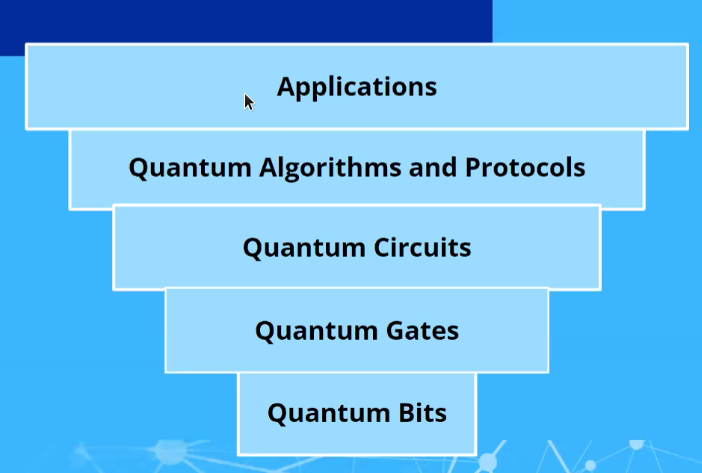
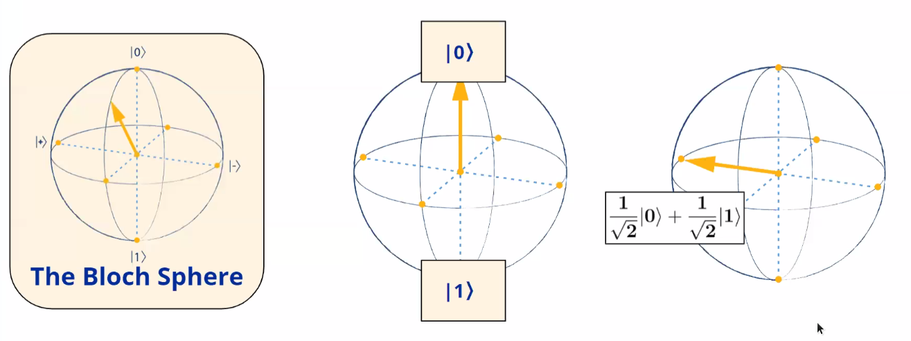
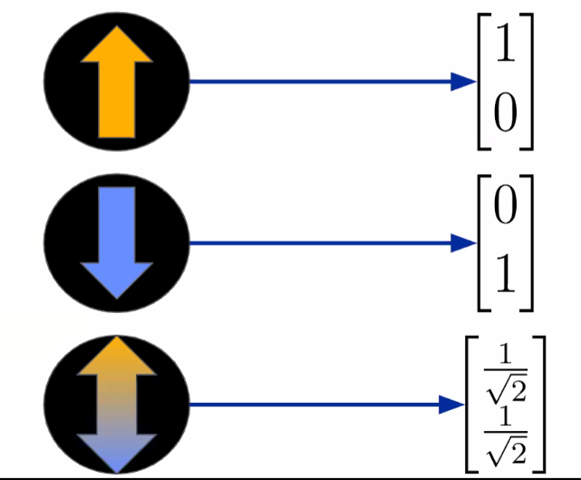
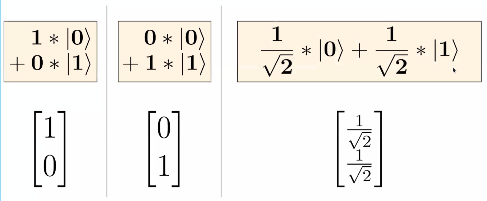
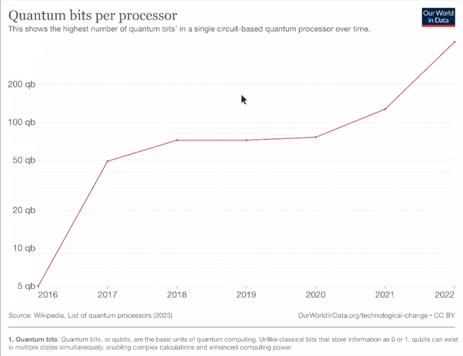
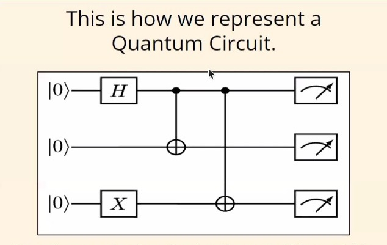

# Quantum Stack
## Limits of Classical Computer

### Moore's Law or Observation:
The number of transistors on a micro processor doubles every year

**Comebacks of Moore's Observation - Quantum Tunnelling:**
Transistors size reduces to fit into the processor moving into size smaller than DNA (2 nanometres) and a processors can handle 50 billion transistors.
But Quantum tunnelling (allowing to teleport to other side of a closed barrier). Electricity which works on the moments of electrons work on quantum principals and size of transistors size decrease errors caused by Quantum tunnelling of electrons are not negligible. This is termed as **End of Moore's Law**

### Landauer's Principle:
Computers erase information and it is irreversible. This means after every step of calculation, the state is lost resulting in irresponsibility. This decreases the entropy of the system in terms of information. Following the rules of thermodynamics for Entropy transistors generate heat, more the transistors then more the heat . 

### Charles's Reversible Computing
Quantum Mechanics is competently reversible hence computers based on the principle of Quantum Mechanics would solve the issue of Landauer's principle.

## Stack

### Qubits
Qubits are extension of regular bits. they can be 0, 1 or superposition of 0 and 1. 
0 $$(\uparrow)$$ and 1 as $$(\downarrow)$$. Superposition state representation is a combination of these two.

### Notations:
**Ket Notion** $$(\ket{})$$:
It is used for representation. Superposition is represented with a prefix of $1/√2$

**Bloch Sphere:**
A 3D visualstic representation of Qubit which is an abstract analogue of Cartesian plane 

**Vector Representation:**

**Note:**
**Superposition:**
It is a state which takes several characteristics from both states (1 and 0). Qubit in such a state is similar to a coin in the air. W cannot determine it's next state until we force it to be one or the other state.  Hence, **Quantum Mechanics is truly Random**

**Progresses in Qubits:**
The number of Qubits in one device now is 433 so far

### Quantum Gates:
Quantum gates perform quantum operations on Qubits to change their state in order to perform Quantum computations. There are 7 such Gates
1. X Gate
2. H Gate

### Quantum Circuits:
These are sequence of Quantum Gates acting on Qubits.

**Note:**
Quantum Measurements is the only way to extract Information about and unknown Quantum State.

## Building a Quantum Computer - DiVincenzo Criteria
1. Stays in Subset of Qubits - Well Characterised
2. Scale able 
3. Can handle Qubits (in terms of thermodynamics)
4. QC Gates
5. Q Measurement (Protective or ensemble)
6. Should handle decoherence (Bleeding of Quantum Information)