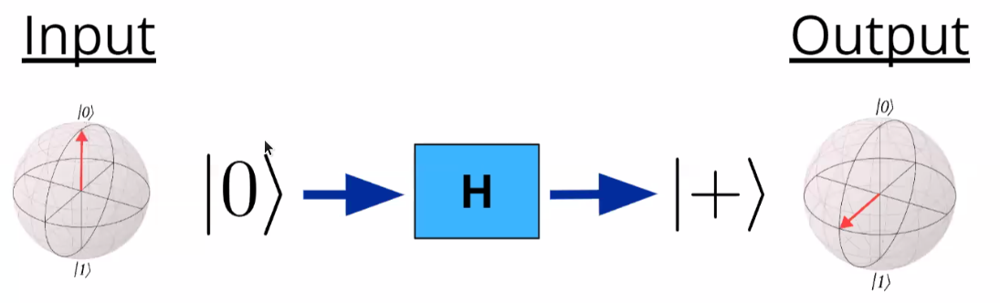

# Bases and Gates

Bases describe the state at which the current position is measured. In terms of Cartesian System it is often describe in the format of P(x,y,z). 

**Note:**
Generic representation considers z-axis to move upwards, x-axis to move towards (or away) us and y-axis to move side ways. 
	
## Bases with respect to Quantum Gates 
Quantum Gates rotate the Qubit represented in the Bloch sphere to rotate. 
### X Gate:
Pauli's X gate rotates the Qubit by **108**$^0$. 

### H Gate:
Hardamard's Gate brings a initialised Qubit to state of superposition.  This gate play a key role in Quantum Computing as it brings the Qubit from Z-bases (0 and 1) to X-bases (+ and -).

### Z Gate:
Pauli's Z gate is used to rotate a Qubit in X-Bases by **180**$^0$. 

### P-Gates:
To be added
### S-Gates:
To be added
### H-Gates:
To be added

**Note:**
1. In physical sense, the state change is shown by applying specific polarised light to the Qubit. This changes the bases or the state of Qubit.
2. By default, gates and circuits are initialised with 0. 