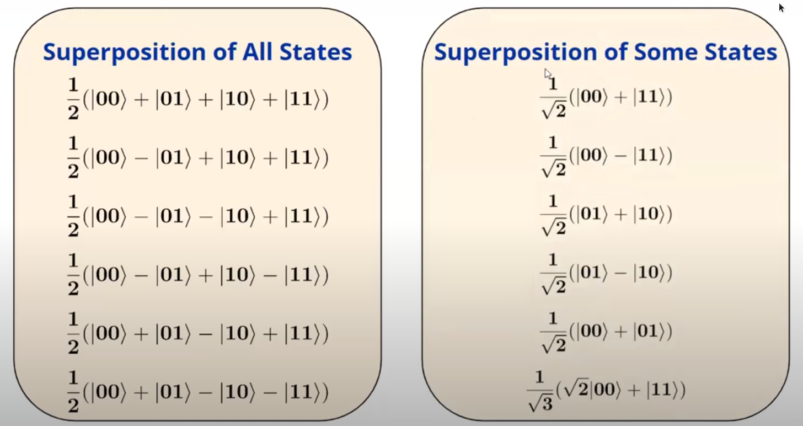
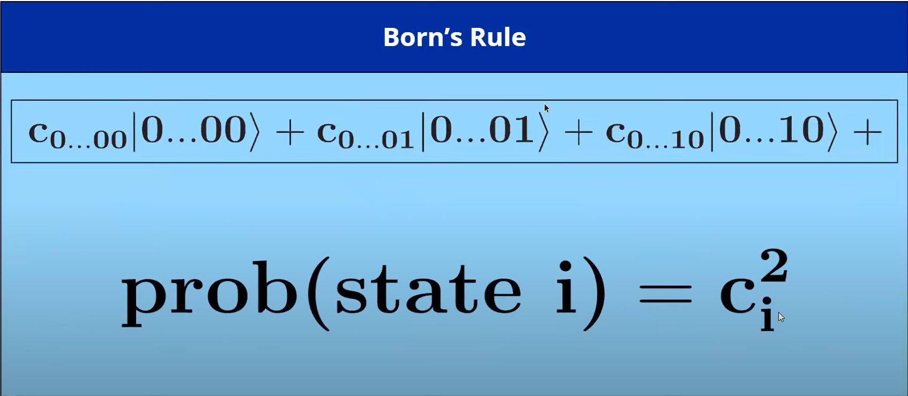
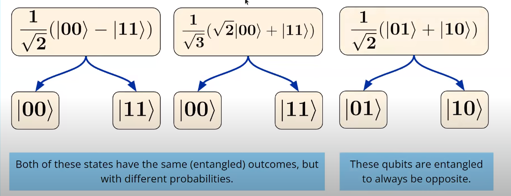
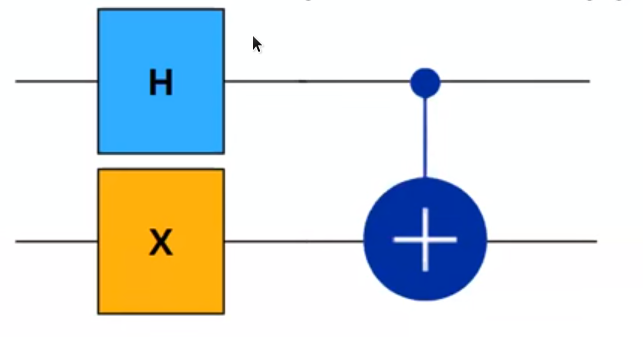
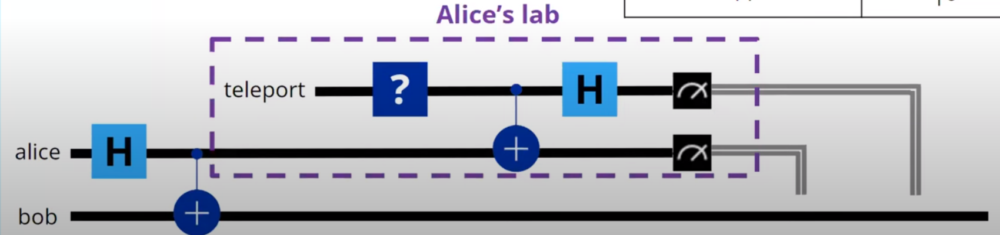
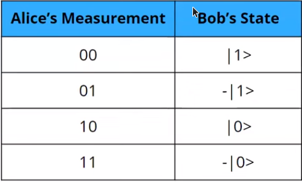

# Multi Qubits and Quantum Teleportation
## Multi Qubits States with Kets

### Superposition

### Born's Rule

## Entanglement

**Example:**

1. Consider two qubits as $q_0$ and $q_1$ each initialised at states $\ket{0}$.
2. *H gate* is applied to $q_0$ and hence we obtain superposition state of $\ket{+}$.
3. *X gate* is applied to $q_1$ and hence it changes to $\ket{1}$
4. In case of *CNOT gate* initially the state of $q_0$ and $q_1$ combine to give $\ket{1+}$ which can expand to give $\frac{1}{\sqrt{2}}(\ket{10}+\ket{11})$
5. After the combined multi-qubit state we have to apply CNOT. Here, $q_0$ is the control bit and $q_1$ as target. Hence, $\ket{10}$ remains as it is as $q_0$ is 0. In case of $\ket{11}$, *X gate* is applied to the $q_1$ part as $q_0$ is 1 giving the changed state to $\ket{01}$.
6. Finally, we can say the resultant of the circuit is $\frac{1}{\sqrt{2}}(\ket{10}+\ket{01})$

## Quantum Teleportation
QT is sending information more efficiently using quantum computers and sending classical bits. It is a protocol that transfers a quantum state from a sender at one location to receiver
in a different location.

**Limitations:**
1. Requires tow parties to share a pair of entangled qubits for every qubit to be teleported.
2. It is not instantaneous and requires classical communication
3. Used to send one qubit at a time not a complex object

**Alice and Bob in QT:**
1. Alice and Bob share and entangled state and on their separate ways.
2. Alice wants to send a special state to teleport to Bob.
3. Alice measures half of the entangled state and her special state in the entangled basis. 
4. The measurement results are sent through classical channels.
5. Bob adjusts his half of entangled state according to Alice's measurements. 

**Mathematical approach to Alice and Bob Quantum Teleportation:**

1. Consider Alice and bob both have qubits of state $\ket{0}$ represented as $\ket{00}$ such that the qubit belongs in this way $\ket{Bob \ Alice}$ (same pattern is followed every where)
2. Entangling both the qubits and attaching a target qubit $q_t$ we get: $\frac{1}{\sqrt{2}} (\ket{00} + \ket{11}) \ket{0}$ which is simplified as$$\frac{1}{\sqrt{2}} (\ket{000} + \ket{110})$$ of pattern $\ket{Bob \ ALice \ Target}$.
3. Preparation of the special qubit: X gate is applied to $q_t$. Hence we get:$$\frac{1}{\sqrt{2}} (\ket{001} + \ket{111})$$ as X gate is applied to the target bit alone.
4. Now Alice entangles the target bit with the previous part of entangled qubit which is done with CNOT gate given as: $$\frac{1}{\sqrt{2}} (CX_{t,a}\ket{001} + CX_{t,a}\ket{111})$$ After applying the CNOT gate: $$\frac{1}{\sqrt{2}} (\ket{011} + \ket{101})$$
5. H gate is applied finally, which can be represented as:$$\frac{1}{\sqrt{2}} (H_t\ket{011} + H_t\ket{101})$$
   This can be simplified as below considering $H_t\ket{1}$ is $\ket{-}$ and which in bases of Z is given as $\ket{0} - \ket{1}$: $$\frac{1}{\sqrt{2}}(\frac{1}{\sqrt{2}} (\ket{010} - \ket{011})) + \frac{1}{\sqrt{2}}(\frac{1}{\sqrt{2}} (\ket{100} - \ket{101}))$$
   Simplified to:$$\frac{1}{2}(\ket{010} - \ket{011} +\ket{100}-\ket{101})$$
6. Measurement is finally done to qubits with Alice .i.e $q_alice$ and $q_t$. Possible measurements are:
   
7. Accordingly to get the $q_t$ back Bob applies Z or X or both gates.
