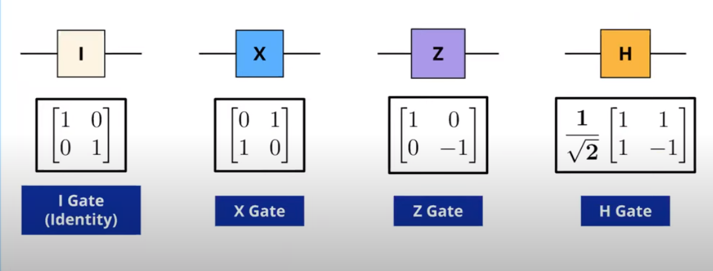

# Quantum Maths for Single Qubit
## Inner Product and Measurement - Born's Rule

For given matrices $u$ and $v$, The inner product is given as ($$u^T$$ is transpose of matrix $$u$$): 

$$
⟨u,v⟩ = u^Tv
$$

Given state vectors of qubits as $$u$$ and $$v$$,  the probability of measuring $$u$$ in $v$ is the square of inner product of $$u$$ and $$v$$ is given as: 

$$
prob(\text{measuring state u in state v}) = (u.v)^2
$$

It can also be said that: 

$$
prob(\text{measuring state u in state v}) = prob(\text{measuring state v in state u})
$$

Inner product can be done easily with bra-ket notations and can be show with following table:

$$
\begin{aligned}
&\begin{array}{cccc}
\hline \hline \text { Notation } & \text { Value }\\
\hline \bra{0}\ket{0} & 1 \\
\bra{1}\ket{1} & 1 \\
\bra{1}\ket{0} & 0 \\
\bra{0}\ket{1} & 0 \\
\bra{+}\ket{0} & \frac{1}{\sqrt{2}} \\
\bra{+}\ket{1} & \frac{1}{\sqrt{2}}\\
\bra{-}\ket{0} & \frac{-1}{\sqrt{2}}\\
\bra{-}\ket{1} & \frac{-1}{\sqrt{2}}\\
\hline
\end{array}
\end{aligned}
$$

Hence, Born's rule for bra-ket notations is give as follows: 

$$
prob(\text{measuring state a in b}) = |\bra{a}\ket{b}|^2
$$

## Gates as Matrices

The transformation go quantum states using gates is given by: $$\text{Gate * State} = \text{New State}$$
