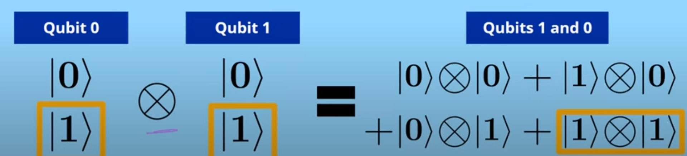
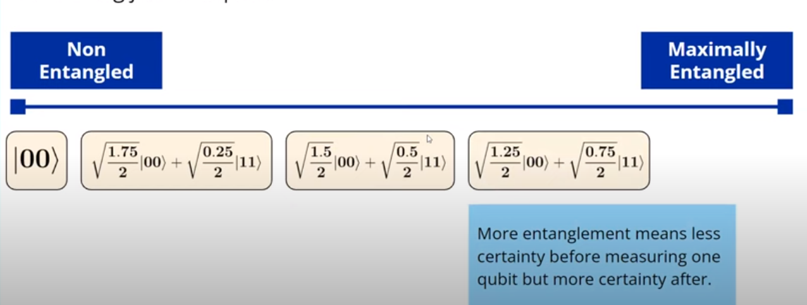

--- 
layout: post
title: Multi Qubit
---
# Multi Qubit Maths
## Tensor Product
Tensor state is used to combine quantum states to represent multiple systems at once. This is given below for matrix A and B:  $$ \mathbf{A} \otimes \mathbf{B} = \begin{bmatrix} A_{1,1} \mathbf{B} & \cdots & A_{1,n} \mathbf{B} \ \vdots & \ddots & \vdots \ A_{m,1} \mathbf{B} & \cdots & A_{m,n} \mathbf{B} \end{bmatrix} $$

## Missing States in Quantum Mechanics
States which can be represented as tensor products are called as **Separable States** on the other hand those states which cannot be represented as separable are **Non-Separable States** which none other than the **Entangled State.** 

Ex: $\frac{1}{\sqrt{2}} (\ket{00} + \ket{11})$ can be represented as tensor product
	
Few famous states are **Bell States** and **GHZ States**. Here are the Bell states:

$$\begin{align*}
|\psi_{BB84}\rangle &= \left\{ \begin{array}{c|c}
\frac{1}{\sqrt{2}} & |00\rangle \\ \hline
\frac{1}{\sqrt{2}} & |11\rangle \\ \hline
0 & \text{otherwise}
\end{array} \right. \\ \\

|\psi_{B2}\rangle &= \left\{ \begin{array}{c|c}
\frac{1}{\sqrt{2}} & |01\rangle \\ \hline
\frac{1}{\sqrt{2}} & |10\rangle \\ \hline
0 & \text{otherwise}
\end{array} \right. \\ \\

|\psi_{B3}\rangle &= \left\{ \begin{array}{c|c}
\frac{1}{\sqrt{2}} & |00\rangle \\ \hline
-\frac{1}{\sqrt{2}} & |11\rangle \\ \hline
0 & \text{otherwise}
\end{array} \right. \\ \\

|\psi_{B4}\rangle &= \left\{ \begin{array}{c|c}
\frac{1}{\sqrt{2}} & |01\rangle \\ \hline
-\frac{1}{\sqrt{2}} & |10\rangle \\ \hline
0 & \text{otherwise}
\end{array} \right.
\end{align*}
$$

## Entanglement as a Spectrum

